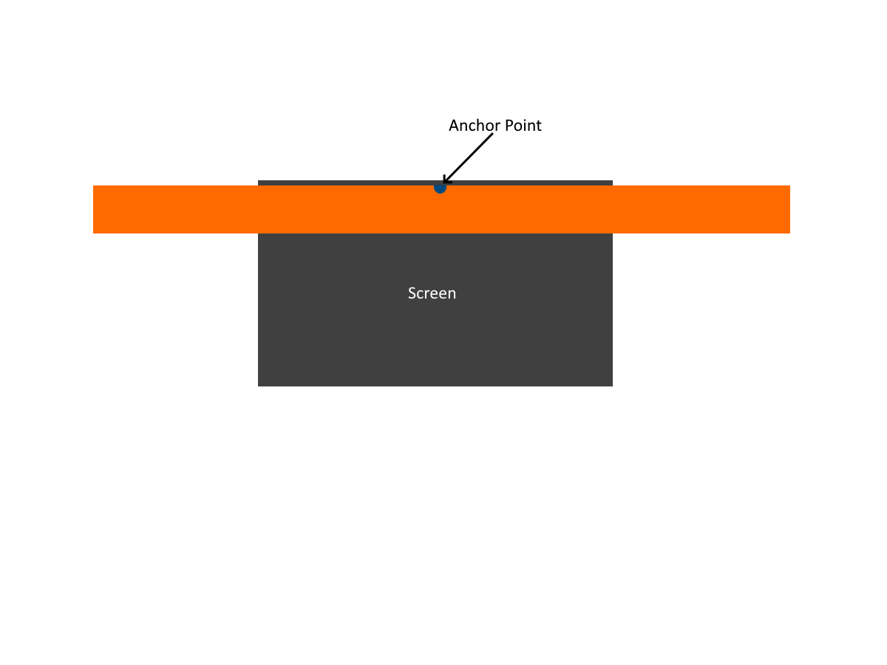
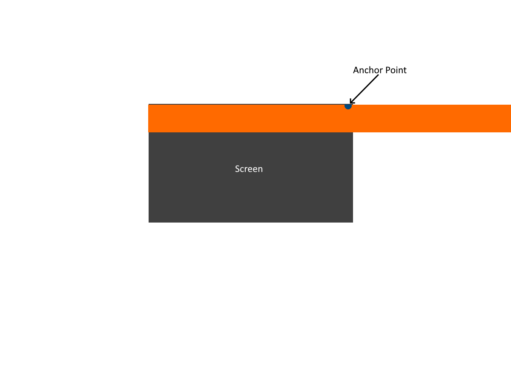

<h1>Creating a Detailed Main Menu</h1>

There seems to be a number of different approaches to creating a main menu. One approach would be to build a heirachical menu leading to different options (Creating a Level Select Screen, a Settings Screen or PlayerList screen) and to be activated with a sense of onclick functions. This comes with the advantage of being easy to build and is convenient for quick startups or simple menus, but may become more difficult to build and maintain for complex menus with deeper submenus.

Some careful consideration must also be put in instances with player menus that are synced with other users menus - such as a lobby seeing what map  a host is selecting - and require a mix of client-server programming.

In this scenario, we will be building a menu that stores the state of the menu (a string) and by creating a listener for the change of values in this state. A function will be binded that decides what menus are visible and are enabled according to this state. This is especially advantageous as we can now bind multiple events to the closing of the menu by simply changing the state instead of manually referencing the specific player's User Interfaces and disabling them one by one. This can be used in cases where if a user is inactive in a lobby screen, where the menu changes after the game detects no userinput after x amount of seconds.

<h2> Server-Client Architecture </h2>

Some games may introduce methods of programming on both server-side and client-side. It is important to understand how the scripts affect the game on the client side, and how it affects the server-side (and how this is effectively replicated to the client side). In some circumstances, code will only happen on particular clients instead of the server (such as opposing enemies not being able to see your ping or minimap) and hence some careful thought is required on how your code should be structured.

The game engine we are working with has the ability to fire Events and Functions for similar boundary interaction (Server -> Server or Own Client -> Own Client) or to use 
Remote Events and Functions for cross-boundary communication (Server -> Client or Client -> Server or chain of these to form Client -> Server -> Client). We want our user to be able to control their own menu for the most part and hence client-sided coding (LocalScripts) will be used in this case.

<h2> Creating a Listener for our State </h2>

The first thing to do is to create the String Value object and reference it. Once done, we will need to create a LocalScript. We can connect the StringValue.Changed event and then pass a function or execute a block responsible for the UI visibilities. The StringValue will be referred to as our Screen State from here on.

```
local CurrentScreenRef = script.Parent            -- Object to listen for changes on
CurrentScreenRef.Changed:Connect(function()        -- Bind a function to the Value Changed event

	if CurrentScreenRef.Value == "MainMenu" then
		-- Make all other screens invisible and MainMenu screen visible
	elseif CurrentScreenRef.Value == "LevelSelect" then
		-- Make all other screens invisible and LevelSelect screen visible
	end
end)
```

<h2> Triggering a State Change </h2>
Now that the screen visibilities are tied to the change of Screen State, we will now need a button that can trigger the change in these screen states. A simple button is created within the MainMenu frame, and a LocalScript will be created underneath to listen for the left mouse click event. Upon clicking, the LocalScript should change the value of the Screen State which will then trigger the previous code block to switch screens.

```
LevelSelectButton = script.Parent		-- Reference the button to listen to

LevelSelectButton.MouseButton1Click:Connect(function()
	script.Parent.Parent.Parent.Parent.Parent.CurrentScreen.Value = "LevelSelect" -- Change the value of the Screen State [Convoluted reference]
end)
```

<h2> Console Compatibility </h2>
As we mentioned before, we can now easily change the player menu now that the visibility is binded to the screen state. UIs on screen which involve a series of mouse clicks can be highly convoluted for console players. However, the same menu can now be controlled by a controller without dragging a cursor by listening for a gamepad input. 
In this case, when a gamepad user presses on the A-Button, the screen should switch to the Level Select menu.

```
local UIS = game:GetService("UserInputService")      -- Call the user input service to detect gamepad input

-- Back function:
local LevelSelectControllerBind = Enum.KeyCode.ButtonA     -- Create a simple comparator value for the user pressing the A button on the gamepad

UIS.InputBegan:Connect(function(input,gameprocessed)    -- Bind the user input to a logic block that determines what key the user has pressed and what actions to take
	if gameprocessed then return end
	
	if input.KeyCode == LevelSelectControllerBind then      
		script.Parent.CurrentScreen.Value = "LevelSelect"    -- Change value of the Screen State
	end
end)
```
Numerous control functions can then be made for each menu, and the respective control function for the menu can be enabled (with the rest being disabled) using our original Screen State Listener control block.


<h2> Animated Background </h2>
Our game engine lacks the ability to create 'video' backgrounds, but we can replicate animated backgrounds using a TweenService. Tweens are responsible for the smooth movement or property changes of ingame parts or User Interface elements, which include smooth animations of positional, orientational, color, transparency, and more. In this example, we will attempt to make 3 rows of images move in different directions (think a slot machine) by applying Tweens to different positions and hence different directions.

The first task is to ensure we have a 'backdrop frame' that covers the entire screen by making the size of the frame {1,0,1,0}. The first parameter corresponds to X-Width in terms of scale size with respect to parent(so 0.5 would be half of it's parent size) and the second parameter corresponds to X-Width with respect to pixels. The 3rd corresponds to Scalar Y, and the 4th would be the Y-height with respect to pixels. It is generally good practice to use Scalar over pixels as screen resolutions may vary across the board, especially when dealing with a game that can be computer, mobile, tablet and console compatible.

The next task is to create the 3 rows of images as a child of the backdrop frame, at {X=0.5, Y=0} , {X=0.5, Y =0.25}, and {X=0.5, Y=0.5} respectively - again editing the scalar property for position instead of the pixels. The size of each row should be {X=2, Y = 0.25} with respect to Scalar again, and with the anchor-point being {0.5,0}. The Anchor-Point determines where the centre of the image will be and hence with the values we have chosen, the full image should still cover the screen after the image has moved to X=0 or X=1 (due to our anchor point and image size). A property for each image called ScaleType can be set to Tile to achieve a repeated image pattern effect.


 

<h2> Animating Each Image Row</h2>

Each row can then be animated using the following steps - calling the Tween Service, creating a TweenInfo, determining target position, creating the tween, and then playing the tween. For the first row, we would like the anchor point to move backwards X=0 so that the image slides left. A tween info takes two parameters, the time taken for the animation/tween and the Easing Style (these include linear, cubic, bounce, and <a href="https://create.roblox.com/docs/reference/engine/enums/EasingStyle"> more </a>), but 0 corresponds to a linear movement for smooth animations. The following is an example of a tween being played for the first row.

```
local TweenServ = game:GetService("TweenService") -- Call the Tween Service
local AnimTime = 20 				-- Determine animation time
local newTweenInfo = TweenInfo.new(AnimTime,0)	-- Create a new tween info with the set animation time and easing style of 0
local TargetPosition = UDim2.new(0,0,0,0)
local TargetRow = script.Parent			-- Reference image to move position of
local OriginPosition = TargetRow.Position

local SlideLeftTween = TweenServ:Create(TargetRow, newTweenInfo, {Position = TargetPosition})	-- Create the tween

SlideLeftTween:Play()	-- Play the tween

SlideLeftTween.Completed:Connect(function()	-- Once tween is completed, reset the position and play the animation again continuously
	TargetRow.Position = OriginPosition
	SlideLeftTween:Play() 
end)
```

By applying these to different rows with different target positions, the eventual outcome should look like (The animation should be smooth - the choppiness is due to the low framerate of the recording software): 


